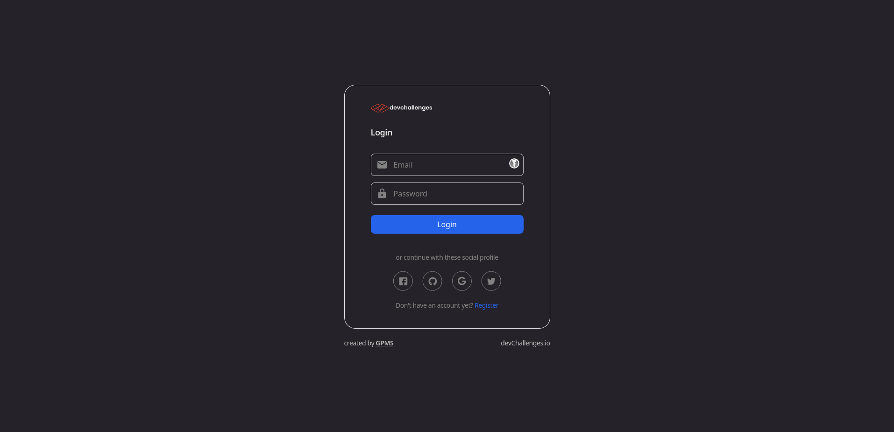

<!-- Please update value in the {}  -->

<h1 align="center">Authentication App</h1>

<div align="center">
   Solution for a challenge from  <a href="http://devchallenges.io" target="_blank">Devchallenges.io</a>.
</div>

<div align="center">
  <h3>
    <a href="https://authentication-app-frontend-five.vercel.app/">
      Demo
    </a>
    <span> | </span>
    <a href="https://{your-url-to-the-solution}">
      Solution
    </a>
    <span> | </span>
    <a href="https://legacy.devchallenges.io/challenges/N1fvBjQfhlkctmwj1tnw">
      Challenge
    </a>
  </h3>
</div>

<!-- TABLE OF CONTENTS -->

## Table of Contents

- [Table of Contents](#table-of-contents)
- [Overview](#overview)
  - [Built With](#built-with)
- [Features](#features)
- [How To Use](#how-to-use)
- [Contact](#contact)

<!-- OVERVIEW -->

## Overview



### Built With

<!-- This section should list any major frameworks that you built your project using. Here are a few examples.-->

- [React](https://reactjs.org/)
- [Tailwind](https://tailwindcss.com/)
- [Express.js](https://expressjs.com/)
- [MongoDB](https://www.mongodb.com/)

## Features

<!-- List the features of your application or follow the template. Don't share the figma file here :) -->

This application/site was created as a submission to a [DevChallenges](https://devchallenges.io/challenges) challenge. The [challenge](https://legacy.devchallenges.io/challenges/N1fvBjQfhlkctmwj1tnw) was to build an application to complete the following user stories:
- [x] I can register a new account
- [x] I can log in
- [ ] I can log in or register with at least one of the following services: Google, Facebook, Twitter or Github
- [x] I can sign out
- [x] I can see my profile details
- [x] I can edit my details including: photo, name, bio, phone, email and password
- [x] I can upload a new photo or provide an image URL (no upload yet, only image URL)

## How To Use

<!-- Example: -->

To clone and run this application, you'll need [Git](https://git-scm.com), [Node.js](https://nodejs.org/en/download/) (which comes with [npm](http://npmjs.com)), and [MongoDB](https://www.mongodb.com/docs/manual/installation/) installed on your computer. From your command line:

```bash
# Clone this repository
$ git clone https://github.com/your-user-name/your-project-name

# Install dependencies
$ cd backend && npm install
$ cd frontend && npm install

# Run MongoDB
$ cd backend && npm run db

# Run the server
$ cd backend && npm run dev

# Run the front end
$ cd frontend && npm run dev
```

## Contact
- GitHub [@GPMS](https://github.com/GPMS)
